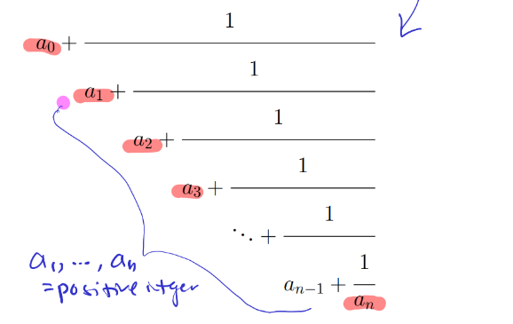

# Decimal Expansion

If $x$ is a real number, then it can be written in the form:

$$
x=\lfloor x \rfloor + \displaystyle\sum_{j=1}^{\infty}{\frac{c_j}{10^j}}
$$

## Calculate

$$
\begin{array}{c}
    \gamma_0=x \\
    \text{for} \quad i \geq 0 \\
    c_i = \lfloor \gamma_i \rfloor \\
    \gamma_{i+1}=10(\gamma_i-c_i)
\end{array}
$$

## Important Formula

$$
\displaystyle\sum_{i=0}^{\infin}{r^i} = \frac{1}{1-r}
$$

## Theorem 1

$x$ is a rational number $\Longleftrightarrow$ $x$ is finite (terminate) or periodic

## Theorem 2

The decimal expansion of $x$ is finite $\Longleftrightarrow$ $x = \frac{r}{s}$, and $2 \mid s$ or $5 \mid s$

# Finite Continued Fractions

A finite continued fraction form is:

If $a_0,a_1,\dots,a_n$ are integers, then it is a finite simple continued fraction, which can be denoted by

$$
[a_0;a_1,a_2,\dots,a_n]
$$

## Theorem 1

1. Every finite simple continued fraction represents a rational number.
2. Every rational number can be expressed by a finite simple continued fraction.

## Theorem 2

$$
[a_0;a_1,a_2,\dots,a_n] = [a_0;a_1,a_2,\dots,a_{n-1},a_n - 1, 1]
$$

# Convergent

If $x = [a_0;a_1,\dots,a_n]$, then $[a_0;a_1,a_2,\dots,a_k]$ is called the $k$th convergent of $x$.

## Theorem 1

Let $a_0,a_1,\dots ,a_n$ be real numbers and positive numbers.

$$
\begin{array}{c}
    p_0 = a_0 \quad q_0 = 1 \\
    p_1 = a_1a_0 + 1 \quad q_1 = a_1 \\
    p_2 = a_2p_1 + p_0 \quad q_2 = a_2q_1 + q_0 \\
    \vdots \\
    p_k = a_kp_{k-1} + p_{k-2} \quad q_k = a_kq_{k-1}+q_{k-2}
\end{array}
$$

Then

$$
\begin{array}{c}
    p_kq_{k-1} - p_{k-1}q_k = (-1)^{k-1} \\
    \gcd(p_k,q_k) = 1
\end{array}
$$

And

$$
\begin{array}{c}
    C_k = [a_0;a_1,a_2,\dots,a_k] = \frac{p_k}{q_k}
\end{array}
$$

## Theorem 2

Let $C_k = \frac{p_k}{q_k}$ be the $k$th convergent of the simple continued fraction $[a_0,a_1,a_2,\dots,a_n]$, then $q_k \geq k$ and

$$
C_k - C_{k-1} = \frac{(-1)^{k-1}}{q_kq_{k-1}}
$$

## Theorem 3

Let $C_k = \frac{p_k}{q_k}$ be the $k$th convergent of the simple continued fraction $[a_0,a_1,a_2,\dots,a_n]$, then

$$
C_0 \lt C_2 \lt C_4 \lt \dots \lt C_5 \lt C_3 \lt C_1
$$

**Proof:**

$$
\begin{array}{c}
    \text{Use Theorem 2} \\
    k = 1 \quad C_1 - C_0 = \frac{(-1)^0}{q_1q_0} = \frac{1}{q_1q_0} > 0 \quad C_1 \gt C_0 \quad \textcircled{1}\\
    k = 2 \quad C_2 - C_1 = \frac{(-1)^{2-1}}{q_2q_1} = \frac{-1}{q_2q_1} \lt 0 \quad C_2 \lt C_1 \quad \textcircled{2} \\
    k = 3 \quad C_3 - C_2 = \frac{1}{q_3q_2} \gt 0 \quad C_3 \gt C_2 \quad \textcircled{3} \\
    \textcircled{1} + \textcircled{2}, \quad (C_1 - C_0) + (C_2 - C_1) = \frac{1}{q_1q_0} + (\frac{-1}{q_2q_1}) \\
    C_2 - C_0 = \frac{q_2-q_0}{q_0q_1q_2} \gt 0 \\
    \therefore C_2 \gt C_0 \\
    \textcircled{2} + \textcircled{3}, \quad (C_2 - C_1) + (C_3 - C_2) = -\frac{1}{q_2q_1} + \frac{1}{q_3q_2} \\
    C_3 - C_1 = \frac{-q_3 + q_1}{q_1 q_2 q_3} \lt 0 \\
    \therefore C_2 \lt C_1 \\
\end{array}
$$

# Infinite Continued Fractions

It is a continued fraction that does not terminate.

## Theorem 1

Let $a_0,a_1,\dots$ be an infinite sequence of positive integers, and let $C_k = [a_0;a_1,\dots,a_k]$. Then the convergent $C_k$ tend to a limit $\alpha$, that is,

$$
\lim_{k \to \infin} C_k = \alpha
$$

## Theorem 2

Let $\alpha = \alpha_0$ be an irrational number. The infinite simple continued fraction expansion of $\alpha$ can be computed by

$$
a_k = \lfloor \alpha_k \rfloor, \quad \alpha_{k+1} = \frac{1}{\alpha_k - a_k}
$$

**Example:**

Find the simple continued fraction expansion of $\sqrt{2}$.

$$
\begin{array}{c}
    \alpha = \sqrt{2} \\
    \alpha_0 = \sqrt{2} \\
    a_0 = \lfloor \alpha_0 \rfloor = 1 \\
    \alpha_1 = \frac{1}{\alpha_0 - a_0} = \frac{1}{\sqrt{2}-1} = \sqrt{2} + 1 \\
    a_1 = \lfloor \alpha_1 \rfloor = 2 \\
    \alpha_2 = \frac{1}{\alpha_1 - a_1} = \frac{1}{\sqrt{2} - 1} = \alpha_1 \\
    \therefore a_1 = a_2 = \dots = 2 \\
    \therefore \sqrt{2} = [1;\bar{2}]
\end{array}
$$

## Theorem 3

Let $\alpha$ be an irrational number with simple continued fraction expansion $[a_0;a_1,a_2,\dots]$ and convergent $C_k = \frac{p_k}{q_k}$, then

$$
\left| \alpha - \frac{p_k}{q_k} \right| \lt \frac{1}{q_kq_{k+1}}
$$

## Dirichlet's Theorem on Diophantine Approximation

If $\alpha$ is an irrational number, then there are infinitely many rational numbers $\frac{p}{q}$ such that

$$
\left| \alpha - \frac{p}{q} \right| \lt \frac{1}{q^2}
$$

## Theorem 4

Let $\alpha$ be an irrational number and let $\frac{p_j}{q_j}$ be the convergent of the infinite simple continued fraction of $\alpha$.

* If $\frac{r}{s}$ is a rational number, $r,s \in \mathbb{Z}, s \gt 0$ and $k \in \mathbb{Z}^+$, then

$$
\lvert s\alpha - r \rvert \lt \lvert q_k\alpha - p_k \rvert \Longrightarrow s \geq q_{k+1}
$$

* If $\frac{r}{s}$ is a rational number, $r,s \in \mathbb{Z}, s \gt 0$ and $k \in \mathbb{Z}^+$, then

$$
\left| \alpha - \frac{r}{s} \right| \lt \left| \alpha - \frac{p_k}{q_k} \right| \Longrightarrow s \gt q_k
$$

which means $\frac{p_k}{q_k}$ is the best rational approximation to $\alpha$ with denominator less than or equal to $q_k$

## Theorem 5

If $\alpha$ is an irrational number and if $\frac{r}{s}, \gcd(r,s) = 1, s \gt 0$ such that:

$$
\left| \alpha - \frac{r}{s} \right| \lt \frac{1}{2s^2}
$$

Then $\frac{r}{s}$ is a convergent of the simple continued fraction expansion of $\alpha$.

# Periodic Continued Fractions

| Type                               | Example                         | Form                                                               |
| ---------------------------------- | ------------------------------- | ------------------------------------------------------------------ |
| finite simple continued fraction   | $\frac{62}{23} = [2;3,5]$       | $2 + \frac{1}{3 + \frac{1}{5}}$                                    |
| infinite simple continued fraction | $\sqrt{2} = [1;\bar{2}]$        | $1 + \frac{1}{2 + \frac{1}{2 + \dots}}$                            |
| periodic continued fraction        | $\sqrt{3} = [1;\overline{1,2}]$ | $1 + \frac{1}{1 + \frac{1}{2 + \frac{1}{1 + \frac{1}{2+ \dots}}}}$ |

# Quadratic Irrationals

An irrational number $\alpha$ is called a quadratic rational number if $\alpha$ is a root of a quadratic polynomial with integer coefficients

$$
A\alpha^2 + B\alpha + C = 0 \quad A,B,C \in \mathbb{Z}
$$

Plus, it always has periodic continued fraction.

## Theorem 1

A real number $\alpha$ is a quadratic irrational number if and only if

$$
\begin{array}{c}
    \exists a,b,c \in \mathbb{Z}, b \gt 0, c \ne 0 \\
    \alpha = \frac{a + \sqrt{b}}{c} \gt 0 \quad \text{where $b$ is not a perfect square}
\end{array}
$$

The conjugate of $\alpha$ is defined as

$$
\alpha^{\prime} = \frac{a - \sqrt{b}}{c}
$$

## Proposition

* The reciprocal of a quadratic irrational is a quadratic irrational.
* The sum of a rational number with a quadratic irrational is a quadratic irrational.

> Reciprocal: The reciprocal of $\frac{p}{q}$ is $\frac{q}{p}$

**Example:**

Evaluate $[\overline{2;3}]$

| $k$ | $a_k$     | $p_k$                          | $q_k$                          | $C_k = \frac{p_k}{q_k}$   |
| --- | --------- | ------------------------------ | ------------------------------ | ------------------------- |
| $0$ | $a_0 = 2$ | $p_0 = a_0 = 2$                | $q_0 = 1$                      | $C_1 = 2$                 |
| $1$ | $a_1 = 3$ | $p_1 = a_1 a_0 + 1 = 7$        | $q_1 = a_1 = 3$                | $C_1 = \frac{7}{3}$       |
| $2$ | $a_2 = x$ | $p_2 = a_2 p_1 + p_0 = 7x + 2$ | $q_2 = a_2 q_1 + q_0 = 3x + 1$ | $C_2 = \frac{7x+2}{3x+1}$ |

$$
\begin{array}{c}
    x = [\overline{2;3}] = 2 + \frac{1}{3 + \frac{1}{2 + \frac{1}{3 + \dots}}} = [2;3,x] = C_2 \\
    \because x = C_2 \\
    \therefore x = \frac{7x+2}{3x+1} \\
    3x^2 - 6x - 2 = 0 \\
    \because x \gt 0 \\
    \therefore x = 1 + \frac{\sqrt{15}}{3} \\
\end{array}
$$

## Theorem 2

If

$$
\alpha = \frac{P_0 + \sqrt{d}}{Q_0}
$$

where $P_0, Q_0 \in \mathbb{Z}$, and $d$ is not perfect square, and $Q_0 \mid (d - P_0^2)$, define

$$
\begin{array}{c}
    \alpha_k = \frac{P_k + \sqrt{d}}{Q_k} \\
    a_k = \lfloor \alpha_k \rfloor \\
    P_{k+1} = a_k Q_k - P_k \\
    Q_{k+1} = \frac{d - P_{k+1}^2}{Q_k} \\
\end{array}
$$

Then $\alpha = [a_0;a_1,a_2,\dots]$

# Lagrange's Theorem

The infinite simple continued fraction of an irrational number is periodic if and only if this number is a quadratic irrational number.

The simple continued fraction of $[a_0;a_1,a_2,\dots]$ is purely periodic if

$$
[a_0;a_1,a_2,\dots] = [\overline{a_0;a_1,a_2,\dots, a_{n-1}}]
$$

## Theorem 1

A simple continued fraction of a quadratic irrational number $\alpha$ is purely periodic if and only if $\alpha \gt 1$ and $-1 \lt \alpha^{\prime} \lt 0$, where $\alpha^{\prime}$ is the conjugate of $\alpha$.

## Theorem 2

If $D \in \mathbb{Z}^+$ that is not perfect square, then

$$
\sqrt{D} = [a_0;\overline{a_1,a_2,\dots,a_n,2a_0}]
$$